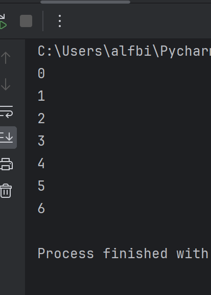
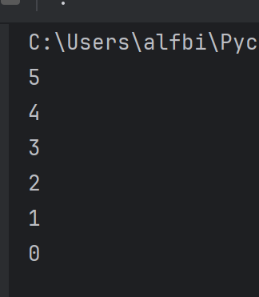
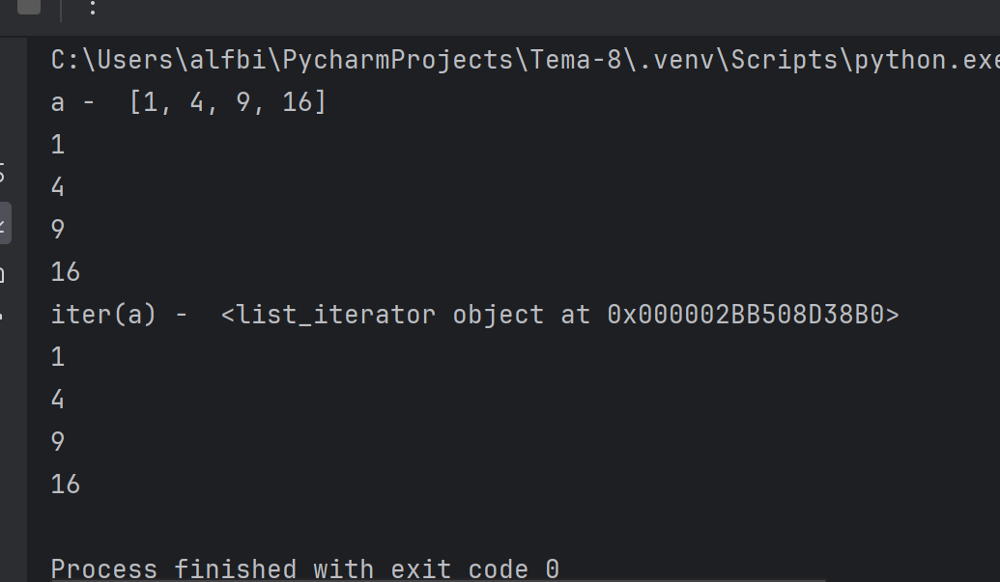
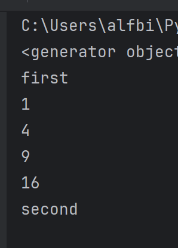
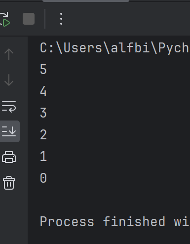

# software-ingineering

Отчет по Теме #11 выполнил(а):

Бидаев Альфред Александрович
- ПИЭ-21-1


| Задание | Лаб_раб | Сам_раб |
| ------ | ------ |---|
| Задание 1 | + | + |
| Задание 2 | + | + |
| Задание 3 | + | + |
| Задание 4 | + | + |
| Задание 5 | + | + |


# Лабораторная работа # 1

### Простой итератор, но у него нет гибкой настройки, например его нельзя развернуть. Он работает просто как next(), но нет prev()

```python
numbers = [0, 1, 2, 3, 4, 5, 6]
for item in numbers:
    print(item)
```
### Результат:




# Лабораторная работа # 2

### Класс итератор с гибкой настройкой и удобным применением

```python
class CountDown:
    def __init__(self, start):
        self.count = start + 1
    def __iter__(self):
        return self
    def __next__(self):
        self.count -= 1
        if self.count < 0:
            raise StopIteration
        return self.count
if __name__ == '__main__':
    counter = CountDown (5)
    for i in counter:
        print(i)
```
### Результат:



# Лабораторная работа # 3

### Генератор списка

```python
a = [i ** 2 for i in range(1, 5)]

print('a - ', a)
for i in a:
    print(i)

print('iter(a) - ', iter(a))
for i in a:
    print(i)
```
### Результат:



# Лабораторная работа # 4

### Выражения генераторы

```python
b = (i ** 2 for i in range(1, 5))
print(b)
print('first')

for i in b:
    print(i)
print('second')

for i in b:
    print(i)
```
### Результат:



# Лабораторная работа # 5

### Такой же счетчик, как и в первом задании, только это генератор и использует yield

```python
def countdown(count):
    while count >= 0:
        yield count
        count -= 1

if __name__ == '__main__':
    counter = countdown(5)
    for i in counter:
        print(i)
```
### Результат:


