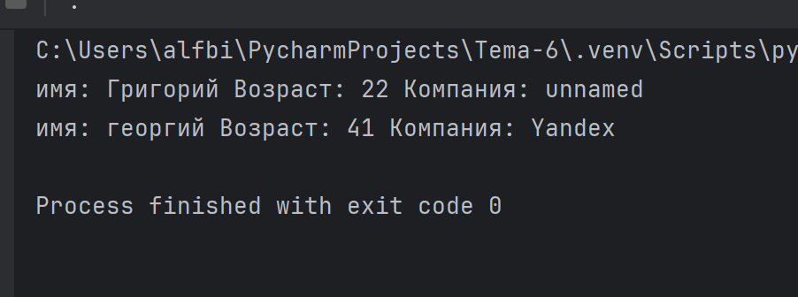

# software-ingineering

Отчет по Теме #6 выполнил(а):

Бидаев Альфред Александрович
- ПИЭ-21-1


| Задание | Лаб_раб | Сам_раб |
| ------ | ------ |---|
| Задание 1 | + | + |
| Задание 2 | + | + |
| Задание 3 | + | + |
| Задание 4 | + | + |
| Задание 5 | + | + |


# Лабораторная работа # 1

### При написании программы необходимо использовать словарь dict, который на вход получает номер кабинета, а выводит необходимую информацию. Если кабинета, который вы ввели нет в словаре, то в консоль в виде значения ключа нужно вывести "None" и виде статуса вывести "False". 

 

# Лабораторная работа # 2

### Алексей решил создать самый большой словарь в мире. Для этого он придумал функцию dict_maker(**kwargs), которая принимает неограниченное количество параметров ключ: значение и обновляет созданный им словарт my_dict, состоящий всего из одного элемента first со значением so easy. 

```python
 from pprint import pprint

my_dict = {'first': 'so easy'}

def dict_maker(**kwargs):
    my_dict.update(**kwargs)

dict_maker(a1=1, a2=20, a3=54, a4=13)
dict_maker(name='Михаил', age=31, weight=70, eyes_color='blue')
pprint(my_dict)
```
### Результат:


# Лабораторная работа # 3

### Для решения некоторых задач бывает необходимо разложить строку на отдельные символы. Мы знаем что это можно сделать при помощи split(), у которого более гибкая настройка для разделения для этого, но если нам нужно посимвольно разделить сроку без всяких условий, то для этого мы можем использовать кортежи (tuple). Для этого напишем любую строку, которую будем делить и "обвернем" ее в tuple и адл it мы можем как угодно с ней работать, например, сделать ее списком (тогда получится полный аналог split()) или же работать с ним дальше, как с кортежем.


```python
input_string = 'HelloWorld'
result = tuple(input_string)
print(result)
print(list(result))
```
### Результат:


# Лабораторная работа # 4

### Вовочка решил написать крутую функцию, которая будет писать имя, возраст и место работы, но при этом на вход функции будет поступать кортеж. Помогите Вовчке написать эту программу.

```python
def personal_info(name, age, company='unnamed'):
    print(f"имя: {name} Возраст: {age} Компания: {company}")

tom = ("Григорий", 22)
personal_info(*tom)

bob = ("георгий", 41, "Yandex")
personal_info(*bob)
```
### Результат:



# Лабораторная работа # 5

### Для сопровождения первых лиц государства Х нужен кортеж, но никто не может определиться с порядком машин, поэтому вам нужно написать функцию, которая будет сортировать кортеж, состоящий из целых чисел по возрастанию, и возвращает его. Если хотя бы один элемент не является целым числом, то функция возвращает исходный кортеж.

```python
def tuple_sort(tpl):
    for elm in tpl:
        if not isinstance(elm, int):
            return tpl
        return tuple(sorted(tpl))

if __name__ == '__main__':
    print(tuple_sort((5, 5, 3, 1, 9)))
    print(tuple_sort((5, 5, 2.1, '1', 9)))
```
### Результат:


# Самостоятельная работа # 1

### при создании сайта у вас возникла потребность обрабатывать данные пользователя в странной форме, а потом переводить их в нужные вам форматы. Вы хтитие принимать от пользователя последовательность чисел, разделенные пробелом, а после переформатировать эти данные в список и кортеж. Реализуйте вашу задумку. Для получения начальных данных используйте input(). результатом программы будет выведенный список и кортеж из начальных данных

```python
user_input = input("Введите последовательность чисел, разделенных пробелом: ")

# Разделяем строку на числа и преобразуем их в список
numbers_list = user_input.split()
numbers_list = [int(num) for num in numbers_list]

# Преобразуем список в кортеж
numbers_tuple = tuple(numbers_list)

# Выводим результат
print("Список из введенных данных:", numbers_list)
print("Кортеж из введенных данных:", numbers_tuple)
```

### Результат:


### Вывод 

Это задание учит следующему:

* Обработке строк: Разделение строки на подстроки (в данном случае, числа), используя разделитель (пробел), и преобразование этих подстрок в числа для дальнейшей обработки.

* Работе с коллекциями: После получения данных в виде списка, задание требует преобразовать этот список в кортеж. Это демонстрирует работу с различными типами коллекций в Python.

* Преобразованию типов данных: Изначально данные поступают в виде строки, их нужно преобразовать в числа для дальнейшей работы.

* Работе с базовыми структурами данных: Задание демонстрирует работу с базовыми структурами данных Python, такими как списки и кортежи.


# Самостоятельная работа # 2

### Николай знает, что кортежи являются неизменяемыми, но он очено умпрямый и всегда хочет доказать, что он прав. Студент решил создать функцию, которая будет удалять первое появление определенного элемента из кортежа по значению и возвращать кортеж без него. Попробуйте повторить шедевр не признающего авторитета начинающего программиста. Но учтите, что Николай не всегда уверен в наличии элемента в кортеже (в этом случае кортеж вернется функцией в исходном виде)

```python
def remove_first_occurrence(tup, element):
    # Проверяем, есть ли элемент в кортеже
    if element in tup:
        # Находим индекс первого вхождения элемента
        index = tup.index(element)
        # Формируем новый кортеж, исключая элемент с найденным индексом
        new_tup = tup[:index] + tup[index+1:]
        return new_tup
    else:
        # Если элемент не найден, возвращаем исходный кортеж
        return tup

# Пример использования функции
my_tuple = (1, 2, 3, 4, 5)
result_tuple = remove_first_occurrence(my_tuple, 3)
print("Исходный кортеж:", my_tuple)
print("Новый кортеж без первого вхождения числа 3:", result_tuple)
```

### Результат:


### Вывод
Это задание учит следующему:

* Работе с кортежами: Задача позволяет понять, как работать с кортежами в Python, включая их основные операции, такие как доступ к элементам, поиск элементов и удаление элементов.

* Управлению данными и их изменяемостью: Хотя кортежи в Python являются неизменяемыми, задание позволяет ученикам понять, как изменить кортеж, создавая новый кортеж на основе старого с удаленным элементом.

# Самостоятельная работа # 3

### ребята поспорили кто из них одним нажатием на numpad наберет больше повторяющихся цифр, но не понимают, как узнать победителя. Вам нужно им помочь. Дана строка в виде случайной последовательности от 0 до 9 (длина строки минимум 15 символов). Требуется создать словарь, который в качестве ключей будет принимать данные числа ( т.е. клчи будут типом int ), а в качестве значений - количестве этих чисел в имеющейся последовательности. Для построения словаря создайте функцию, принимающую строку из цифр. Функция должна возвратить словарь из 3-х самых часто встречаемых числе, также эти значения нужно вывести в порядке возрастания ключа

```python
def count_digits(input_string):
    # Создаем пустой словарь для подсчета повторений чисел
    digit_count = {}

    # Считаем повторения каждой цифры и сохраняем их в словаре
    for digit in input_string:
        if digit.isdigit():
            digit = int(digit)
            if digit in digit_count:
                digit_count[digit] += 1
            else:
                digit_count[digit] = 1

    # Сортируем словарь по значениям (количеству повторений) в убывающем порядке
    sorted_digits = sorted(digit_count.items(), key=lambda x: x[1], reverse=True)

    # Формируем новый словарь из трех наиболее часто встречающихся чисел
    top_three = {}
    for item in sorted_digits[:3]:
        top_three[item[0]] = item[1]

    return top_three

# Пример использования функции
input_string = "222222444555599"
result = count_digits(input_string)
print("Словарь из трех наиболее часто встречающихся чисел:", result)
```

### Результат:


### Вывод

Это задание учит следующему: 

* Работе со словарями: Задание требует создания словаря для подсчета повторяющихся цифр и выбора трех наиболее часто встречающихся чисел. Это позволяет учащимся понять, как работать со словарями в Python, включая добавление элементов, сортировку и извлечение значений.

* Сортировке данных: Для выбора трех наиболее часто встречающихся чисел необходимо отсортировать словарь по значениям (количеству повторений) в убывающем порядке. Это позволяет учащимся развить навыки сортировки данных в Python.

* Работе с функциями: Создание функции, которая принимает строку и возвращает словарь с наиболее часто встречающимися числами, помогает учащимся понять, как определять и использовать функции для повторного использования кода.

# Самостоятельная работа # 4

### Ваш хороший друг владеет офисом со входом по электронным картам, ему нужно чтобы вы написали программу, которая показывала в каком порядке сотрудники входили и выходили из офиса. Определение сотрудника происходит по id. Напишите функцию, которая на вход принимает кортеж и случайный элемент (id), его можно придумать самостоятельно. Требуется вернуть новый кортеж, начинающийся с первого появления элемента в нем и заканчивающийся вторым его появлением включительно. Если элемента нет вовсе - вернуть пустой кортеж. Если элемент встречается только один раз, то вернуть кортеж, который начинается с него и идет до конца исходного.

```python
def employee_activity(activity_log, employee_id):
    # Ищем первое вхождение элемента в кортеже
    if employee_id not in activity_log:
        return ()  # Если элемента нет вовсе, возвращаем пустой кортеж

    start_index = activity_log.index(employee_id)

    # Ищем второе вхождение элемента в кортеже
    try:
        end_index = activity_log.index(employee_id, start_index + 1)
    except ValueError:  # Если второго вхождения нет, возвращаем срез от первого вхождения до конца
        return activity_log[start_index:]

    # Если оба вхождения найдены, возвращаем срез от первого вхождения до второго включительно
    return activity_log[start_index:end_index + 1]


activity_log = (1, 8, 3, 4, 8, 8, 9, 2)
employee_id = 8
result = employee_activity(activity_log, employee_id)
print("Порядок активности сотрудника с id", employee_id, ":", result)
```

### Результат:


### Вывод

Это задание учит следующему:

* Работе с кортежами: Задача требует работать с кортежами в Python, включая поиск элементов и создание новых кортежей на основе исходных.

* Работе с индексами: Для выполнения задания необходимо использовать индексы элементов кортежа, чтобы определить порядок появления заданного элемента.

* Обработке исключений: В задании учитывается возможность отсутствия элемента в кортеже, а также случай, когда элемент встречается только один раз. Это требует обработки исключений и особого внимания к граничным случаям.
