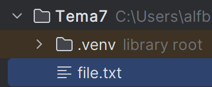
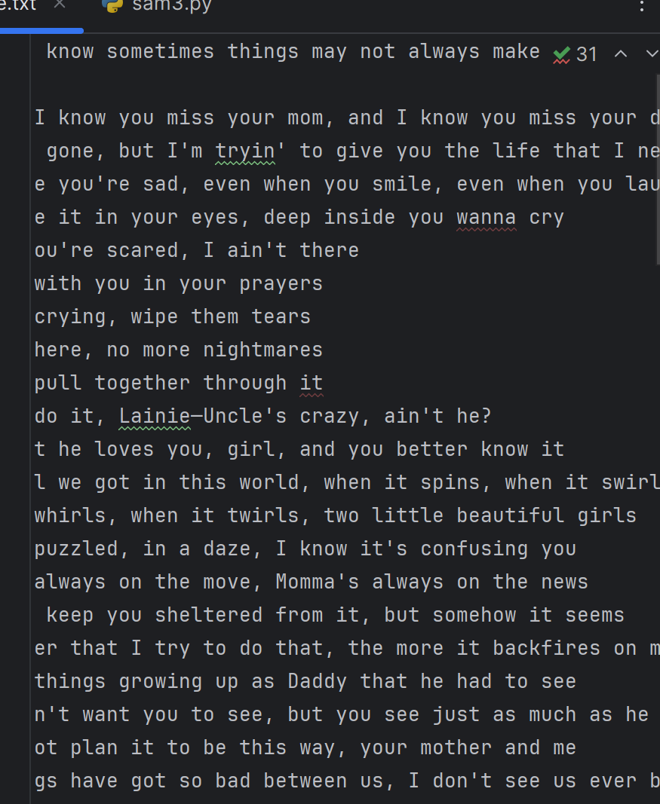

# software-ingineering

Отчет по Теме #7 выполнил(а):

Бидаев Альфред Александрович
- ПИЭ-21-1


| Задание | Лаб_раб | Сам_раб |
| ------ | ------ |---|
| Задание 1 | + | + |
| Задание 2 | + | + |
| Задание 3 | + | + |
| Задание 4 | + | + |
| Задание 5 | + | + |


# Лабораторная работа # 1

### Составьте текстовый файл и положите его в одну директорию с программой на Python. Текстовый файл должен состоять минимум из двух строк.

```python
 
```
### Результат:



# Лабораторная работа # 2

### Напишите программу, котора выведет только первую строку из вашего файла, при этом используйте конструкцию open()/close()

```python
 file = open('file.txt', 'r')
print(file.readline())
file.close()
```
### Результат:


# Лабораторная работа # 3

### Напишите программу, которя выведет все строки из вашего файла в массиве, при этом используйте конструкцию open/close

```python
file = open('file.txt', 'r')
print(file.readlines())
file.close()
```
### Результат:


# Лабораторная работа # 4

### Напишите программу, которая выведет все строки из вашего файла в массиве, при этом используйте конструкцию with open().

```python
with open('file.txt') as f:
    print(f.readlines())
```
### Результат:


# Лабораторная работа # 5

### Напишите программу, которая выведет каждую строку из вашего файла отдельно, при этом используйте конструкцию with open()

```python
with open('file.txt') as f:
    for line in f:
        print(line)
```
### Результат:


# Лабораторная работа # 6

### Напишите программу, которая будет добавлять новую строку в ваш файл, а потом выведет полученный файл в консоль. Вывод можно осуществлять любым спобом. Обязательно проверьте сам файл, чтобы изменения в нем тоже отображались.

```python
with open('file.txt', 'a+') as f:
    f.write('\nIm additional line')

with open('file.txt', 'r') as f:
    result = f.readlines()
    print(result)
```
### Результат:


# Лабораторная работа # 7

### Напишите программу, которая перепишет всю информацию, которая была у вас в файле до этого, например напишет любые данные из произвольно вами составленного списка. Также не забудьте проверить что измененная вами информация сохранилась в файле.

```python
lines = ['one', 'two', 'three']
with open('file.txt', 'w') as f:
    for line in lines:
        f.write('\nCycle run ' + line)
    print('Done!')
with open('file.txt', 'r') as f:
    print(f.readlines())
```
### Результат:


# Лабораторная работа # 8

### Выберите любую папку на своем своем компьютере, имеющую вложенные директории. Выведите на печать в терминал ее содержимое, как и всех подкаталогов при помощи функции print_docs(directory)

```python
import os

def print_docs(directory):
    all_files = os.walk(directory)
    for catalog in all_files:
        print(f'Папка {catalog[0]} содержит: ')
    print(f'Директрии: {", ".join([file for file in catalog[2]])}')

    print('-' * 40)

print_docs('C:/Users/alfbi/Documents/')
```
### Результат:


# Лабораторная работа # 9

### 

```python

```
### Результат:

# Лабораторная работа # 10

### Требуется реализовать функцию, которая выводит слово, имеющее максимальную длину (или список слов, если таковых несколько). Проверьте работоспособность программы на своем наборе слов

```python
def longest_words(file):
    with open(file, encoding='utf-8') as f:
        words = f.read().split()
        max_lenght = len(max(words, key=len))
        for word in words:
            if len(word) == max_lenght:
                sought_words = word

        if len(sought_words) == 1:
            return sought_words[0]
        return sought_words
print(longest_words('file.txt'))
```
### Результат:


# Самостоятельная работа # 1

### Найдите в интернете любую статью ( объем статьи не менее 200 слов), скипируйте ее содержимое в файл и напишите программу, которая считает количество слов в текстовом файле и определит самое часто встречающееся слово. Результатом выполнения задачи будет: скриншот файла со статьей, листинг кода, и вывод в консоль

```python
from collections import Counter

def count_words_and_most_common_word(filename):
    try:
        # Открываем файл для чтения
        with open(filename, 'r', encoding='utf-8') as file:
            # Читаем содержимое файла и разбиваем его на слова
            words = file.read().split()

            # Подсчитываем количество слов в файле
            word_count = len(words)

            # Используем Counter для подсчета частоты каждого слова
            word_freq = Counter(words)

            # Находим самое часто встречающееся слово
            most_common_word = word_freq.most_common(1)[0][0]

            return word_count, most_common_word
    except FileNotFoundError:
        print("Файл не найден.")
    except Exception as e:
        print("Произошла ошибка:", e)

# Пример использования функции
filename = 'file.txt'  # Имя файла для анализа
result = count_words_and_most_common_word(filename)
if result:
    word_count, most_common_word = result
    print("Количество слов в файле:", word_count)
    print("Самое часто встречающееся слово:", most_common_word)

```
### Результат:


### Вывод:

Это задание учит следующему:

* Работе с файлами: Задача требует чтения содержимого текстового файла. Это помогает учащимся развить навыки работы с файловой системой в Python.

* Использованию структур данных: Для подсчета частоты слов используется структура данных Counter из модуля collections. Это помогает учащимся понять, как эффективно использовать структуры данных для решения задач.

* Управлению потоком выполнения: Код включает обработку исключений для случая, если файл не найден, что помогает понять, как управлять потоком выполнения программы и обрабатывать возможные ошибки.

# Самостоятельная работа # 2

### У вас появилась потребность в ведени книги расходов, посмотрев все существующие варианты вы пришли к выводу, что вас ничего не устраивает и нужно все делать самому. Напишите программу для учета расходов. Программа должна позволять вводить информацию о расходах, сохранять как в файл и выводить существующие данные в консоль. Ввод информации происходит через консоль. 

```python
import json

def add_expense(expenses, category, amount):
    if category in expenses:
        expenses[category] += amount
    else:
        expenses[category] = amount

def save_expenses(expenses, filename):
    with open(filename, 'w') as file:
        json.dump(expenses, file)

def load_expenses(filename):
    try:
        with open(filename, 'r') as file:
            expenses = json.load(file)
    except FileNotFoundError:
        expenses = {}
    return expenses

def print_expenses(expenses):
    print("Текущие расходы:")
    if expenses:
        for category, amount in expenses.items():
            print(f"{category}: {amount}")
    else:
        print("Нет сохраненных расходов")

def main():
    expenses_filename = "expenses.json"
    expenses = load_expenses(expenses_filename)

    while True:
        print("\nВыберите действие:")
        print("1. Добавить расход")
        print("2. Вывести текущие расходы")
        print("3. Выход")

        choice = input("Ваш выбор: ")

        if choice == "1":
            category = input("Введите категорию расхода: ")
            amount = float(input("Введите сумму расхода: "))
            add_expense(expenses, category, amount)
            save_expenses(expenses, expenses_filename)
            print("Расход успешно добавлен!")
        elif choice == "2":
            print_expenses(expenses)
        elif choice == "3":
            print("Программа завершена.")
            break
        else:
            print("Неверный ввод. Пожалуйста, выберите доступное действие.")

if __name__ == "__main__":
    main()

```
### Результат:


### Вывод:

Это задание учит:

* Работе с консольным вводом и выводом: Задача требует взаимодействия с пользователем через консольный ввод и вывод. Это помогает учащимся развить навыки работы с вводом и выводом данных в Python.

* Работе с файлами: Программа сохраняет информацию о расходах в файле и загружает ее при каждом запуске. Это помогает понять, как работать с файловой системой в Python, открывать, сохранять и закрывать файлы.

* Использованию словарей: Расходы хранятся в виде словаря, где ключами являются категории расходов, а значениями - суммы расходов по каждой категории. Это помогает понять, как использовать словари для организации и хранения данных.

* Управлению потоком выполнения: Программа имеет основной цикл, который продолжается до тех пор, пока пользователь не выберет выход. Это помогает понять, как управлять потоком выполнения программы с использованием циклов и условий.

# Самостоятельная работа # 3

### Имеется файл с текстом на латинице. Напитеши программу, которая выводит статистику по тексту: количество букв латинского алфавита, число слов, число строк

```python
def text_statistics(filename):
    try:
        with open(filename, 'r', encoding='utf-8') as file:
            text = file.read()

            # Подсчет количества букв латинского алфавита
            latin_letters = sum(1 for char in text if char.isalpha() and char.isascii())

            # Подсчет количества слов
            words = text.split()
            word_count = len(words)

            # Подсчет количества строк
            lines = text.split('\n')
            line_count = len(lines)

            return latin_letters, word_count, line_count
    except FileNotFoundError:
        print("Файл не найден.")
    except Exception as e:
        print("Произошла ошибка:", e)

# Пример использования функции
filename = 'file.txt'  # Имя файла для анализа
result = text_statistics(filename)
if result:
    latin_letters, word_count, line_count = result
    print("Количество букв латинского алфавита:", latin_letters)
    print("Число слов:", word_count)
    print("Число строк:", line_count)

```
### Результат:




### Вывод:

Это задание учит следующему:

* Работе с файлами: Программа работает с текстовым файлом, читает его содержимое и анализирует текст. Это помогает учащимся развить навыки работы с файловой системой в Python.

* Обработке текстовых данных: Программа анализирует текст на наличие букв латинского алфавита, слов и строк. Это помогает понять, как обрабатывать и анализировать текстовые данные в Python.

* Работе со строками: Для подсчета количества слов и строк используются методы работы со строками, такие как split() и подсчет элементов списка. Это помогает учащимся развить навыки работы со строками в Python.

* Использованию встроенных методов и функций: В программе используются встроенные методы строк, такие как split() и isalpha(), а также встроенные функции Python, такие как len(). Это помогает понять, как использовать стандартные методы и функции для решения задач.

# Самостоятельная работа # 4

### Напишите программу, которая получает на вход предложение, выводит его в терминал, заменяя все запрещенные слова звездочками * (количество звездочек равно количеству букв в слове). Запрещенные слова, разделенные символом пробела, хранятся в текстовом файле input.txt. Все слова в этом файле записаны в нижнем регистре. Программа должна заменить запрещенные слова, где бы они ни встречались, даже в середине другого слова. Замена производится независимо от регистра: если файл input.txt содержит запрещенное слово ехат, то слова ехат,
Exam, ЕхаМ, ЕХАМ и ехАт должны быть заменены на ****
• Запрещенные слова:
hello email python the exam wor is
• Предложение для проверки:
Hello, world! Python IS the programming language of thE future. My EMAIL is....
PYTHON is awesome!!!!

```python
def censor_sentence(sentence, banned_words):
    censored_sentence = sentence.lower()  # Приводим предложение к нижнему регистру
    for word in banned_words:
        censored_sentence = censored_sentence.replace(word, '*' * len(word))  # Заменяем запрещенные слова звездочками
    return censored_sentence

def load_banned_words(filename):
    try:
        with open(filename, 'r', encoding='utf-8') as file:
            banned_words = file.read().split()  # Читаем запрещенные слова из файла
            return banned_words
    except FileNotFoundError:
        print("Файл не найден.")
        return []

def main():
    banned_words_filename = 'ban.txt'  # Имя файла с запрещенными словами
    sentence = input("Введите предложение для проверки: ")  # Получаем предложение от пользователя
    print("Предложение для проверки:", sentence)

    banned_words = load_banned_words(banned_words_filename)  # Загружаем запрещенные слова из файла
    if banned_words:
        censored_sentence = censor_sentence(sentence, banned_words)  # Цензурируем предложение
        print("Цензурированное предложение:", censored_sentence)
    else:
        print("Нет запрещенных слов для цензуры.")

if __name__ == "__main__":
    main()

```
### Результат:


