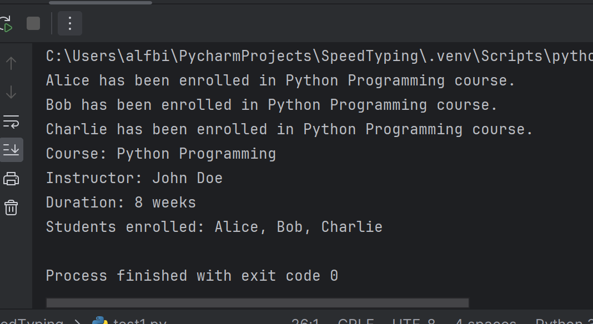

# software-ingineering

Отчет по Теме #9 выполнил(а):

Бидаев Альфред Александрович
- ПИЭ-21-1


| Задание | Лаб_раб | Сам_раб |
| ------ | ------ |---|
| Задание 1 | + | + |
| Задание 2 | + | + |
| Задание 3 | + | + |
| Задание 4 | + | + |
| Задание 5 | + | + |


# Лабораторная работа # 1

### Создайте класс "Car" с атрибутами производитель и модель. Создайте объект этого класса. Напишите комментарии для кода, объясняющие его работу. Результатом выполнения задания будет листинг кода с комментариями.

```python
class Car:
    def __init__(self, make, model):
        self.make = make
        self.model = model
my_car = Car ("Toyota", "Corolla")
```
### Результат:

# Лабораторная работа # 2

### Дополните код из первого задания, добавив в него атрибуты и методы класса, заставьте машину "поехать". Напишите комментарии для кода, объясняющие его работу. Результатом выполнения задания будет листинг кода с комментариями и получившийся вывод в консоль.

```python
class Car:
    def __init__(self, make, model):
        self.make = make
        self.model = model

    def drive(self):
        print(f"Driving the {self.make} {self.model}")

my_car = Car ("Toyota", "Corolla")
my_car.drive()
```
### Результат:


# Лабораторная работа # 3

### Создайте новый класс "ElectricCar" с методом "charge" и атрибутом емкость батареи. Реализуйте его наследование от класса, созданного в первом задании. Заставьте машину поехать, а потом заряжаться. Напишите комментарии для кода, объясняющие его работу.
Результатом выполнения задания будет листинг кода с комментариями и получившийся вывод в консоль.

```python
# Определение класса ElectricCar, который является подклассом класса Car
class ElectricCar(Car):
    # Конструктор класса ElectricCar, принимающий марку, модель и емкость батареи
    def __init__(self, make, model, battery_capacity):
        # Вызов конструктора родительского класса с помощью super(),
        # чтобы инициализировать атрибуты марки и модели
        super().__init__(make, model)
        # Инициализация нового атрибута battery_capacity емкостью батареи
        self.battery_capacity = battery_capacity

    # Метод charge(), который выводит сообщение о зарядке электромобиля
    def charge(self):
        print(f"Charging the {self.make} {self.model} with {self.battery_capacity} kWh")

# Создание экземпляра класса ElectricCar с маркой Tesla, моделью Model S и емкостью батареи 75 кВт⋅ч
my_electric_car = ElectricCar("Tesla", "Model S", 75)

# Вызов метода drive() у экземпляра my_electric_car, унаследованного от родительского класса Car
my_electric_car.drive()

# Вызов метода charge() у экземпляра my_electric_car класса ElectricCar
my_electric_car.charge()

```
### Результат:


# Лабораторная работа # 4

### Реализуйте инкапсуляцию для класса, созданного в первом задании.
Создайте защищенный атрибут производителя и приватный атрибут модели. Вызовите защищенный атрибут и заставьте машину поехать.
Напишите комментарии для кода, объясняющие его работу.
Результатом выполнения задания будет листинг кода с комментариями и получившийся вывод в консоль.

```python
class Car:
    def __init__(self, make, model):
        self.make = make
        self.model = model

    def drive(self):
            print(f"Driving the {self.make} {self.model}")

my_car = Car ("Toyota", "Corolla")
print(my_car.make)
my_car.drive()
```
### Результат:


# Лабораторная работа # 5

### Реализуйте полиморфизм создав основной (общий) класс "Shape", а также еще два класса "Rectangle" и "Circle". Внутри последних двух классов реализуйте методы для подсчета площади фигуры. После этого создайте массив с фигурами, поместите туда круг и прямоугольник, затем при помощи цикла выведите их площади. Напишите комментарии для кода, объясняющие его работу. Результатом выполнения задания будет листинг кода с комментариями и получившийся вывод в консоль.

```python
class Shape:
    def area(self):
        pass

class Rectangle(Shape):
    def __init__(self, width, height):
        self.width = width
        self.height = height

    def area(self):
        return self.width * self. height
class Circle(Shape):
    def __init__ (self, radius) :
        self.radius = radius
    def area(self):
        return 3.14 * self. radius * self. radius
```
### Результат:


# Самостоятельная работа № 1

### Самостоятельно создайте класс и его объект. Они должны отличаться от тех, что указаны в теоретическом материале и лабораторных заданиях

```python
class Course:
    def __init__(self, name, instructor, duration):
        self.name = name
        self.instructor = instructor
        self.duration = duration
        self.students = []  # Список студентов по умолчанию пуст

    def add_student(self, student_name):
        self.students.append(student_name)
        print(f"{student_name} has been enrolled in {self.name} course.")

    def get_course_info(self):
        info = f"Course: {self.name}\nInstructor: {self.instructor}\nDuration: {self.duration} weeks\nStudents enrolled: {', '.join(self.students)}"
        return info

# Создание объекта класса Course
python_course = Course("Python Programming", "John Doe", 8)

# Добавление студентов
python_course.add_student("Alice")
python_course.add_student("Bob")
python_course.add_student("Charlie")

# Вывод информации о курсе
print(python_course.get_course_info())

```

### Результат




# Самостоятельная работа № 2

### Самостоятельно создайте атрибуты и методы для ранее созданного класса. Они должны отличаться, от тех, что указаны в теоретическом материиале

```python
class Course:
    def __init__(self, name, instructor, duration):
        self.name = name
        self.instructor = instructor
        self.duration = duration
        self.students = []  # Список студентов по умолчанию пуст

    def add_student(self, student_name):
        self.students.append(student_name)
        print(f"{student_name} has been enrolled in {self.name} course.")

    def get_course_info(self):
        info = f"Course: {self.name}\nInstructor: {self.instructor}\nDuration: {self.duration} weeks\nStudents enrolled: {', '.join(self.students)}"
        return info

# Создание объекта класса Course
python_course = Course("Python Programming", "John Doe", 8)

# Добавление студентов
python_course.add_student("Alice")
python_course.add_student("Bob")
python_course.add_student("Charlie")

# Вывод информации о курсе
print(python_course.get_course_info())
```

### Результат


# самостоятельная работа № 3

### Самостоятельно реализуйте наследование

```python
class OnlineCourse(Course):
    def __init__(self, name, instructor, duration, platform):
        super().__init__(name, instructor, duration)
        self.platform = platform

    def get_course_info(self):
        info = super().get_course_info()
        info += f"\nPlatform: {self.platform}"
        return info

# Создание объекта подкласса OnlineCourse
python_online_course = OnlineCourse("Python Programming", "John Doe", 8, "Udemy")

# Добавление студентов
python_online_course.add_student("Alice")
python_online_course.add_student("Bob")
python_online_course.add_student("Charlie")

# Вывод информации о курсе
print(python_online_course.get_course_info())
```

# самостоятельная работа № 4

### Самостоятельно реализуйте инкапсуляцию

```python
class Course:
    def __init__(self, name, instructor, duration):
        self._name = name
        self._instructor = instructor
        self._duration = duration
        self._students = []  # Список студентов по умолчанию пуст

    def add_student(self, student_name):
        self._students.append(student_name)
        print(f"{student_name} has been enrolled in {self._name} course.")

    def get_course_info(self):
        info = f"Course: {self._name}\nInstructor: {self._instructor}\nDuration: {self._duration} weeks\nStudents enrolled: {', '.join(self._students)}"
        return info

    # Методы для доступа к закрытым атрибутам
    def get_name(self):
        return self._name

    def set_name(self, name):
        self._name = name

    def get_instructor(self):
        return self._instructor

    def set_instructor(self, instructor):
        self._instructor = instructor

    def get_duration(self):
        return self._duration

    def set_duration(self, duration):
        self._duration = duration

# Создание объекта класса Course
python_course = Course("Python Programming", "John Doe", 8)

# Использование методов доступа и установки для атрибутов
print("Before modification:")
print("Course name:", python_course.get_name())
print("Instructor:", python_course.get_instructor())
print("Duration:", python_course.get_duration())

python_course.set_name("Advanced Python Programming")
python_course.set_instructor("Jane Smith")
python_course.set_duration(10)

print("\nAfter modification:")
print("Course name:", python_course.get_name())
print("Instructor:", python_course.get_instructor())
print("Duration:", python_course.get_duration())

```

# самостоятельная работа № 5

### Самостоятельно реализуйте Полиморфизм

```python

```
