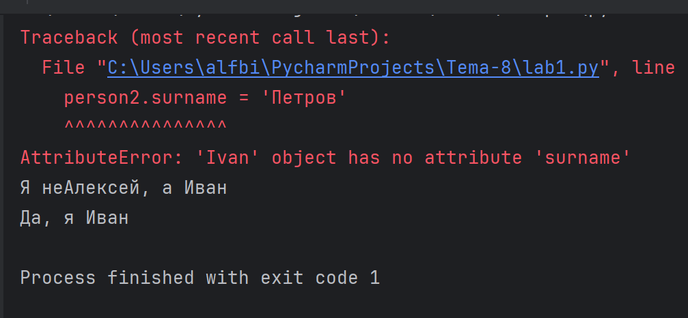
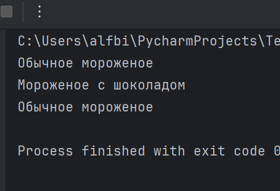
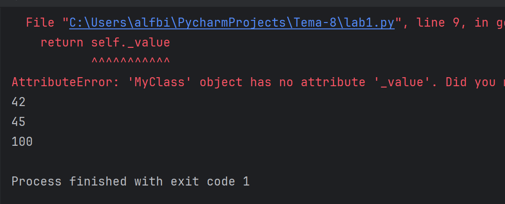
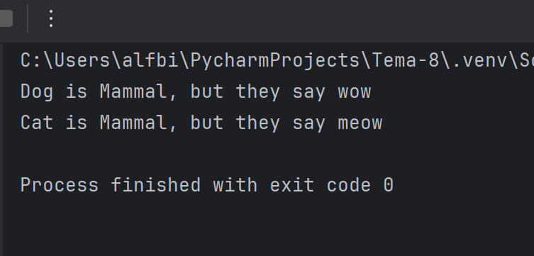
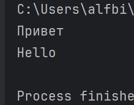

# software-ingineering

Отчет по Теме #9 выполнил(а):

Бидаев Альфред Александрович
- ПИЭ-21-1


| Задание | Лаб_раб | Сам_раб |
| ------ | ------ |---|
| Задание 1 | + | + |
| Задание 2 | + | + |
| Задание 3 | + | + |
| Задание 4 | + | + |
| Задание 5 | + | + |


# Лабораторная работа # 1

### Допустим, что вы решили оригинально и немного странно познакомится с человеком. Для этого у вас должен быть написан свой класс на Python, который будет проверять угадал ваше имя человек или нет. Для этого создайте класс, указав в свойствах только имя. Дальше создайте функцию _init__, а в ней сделайте проверку на то угадал человек ваше имя или нет. Также можете проверить что будет, если в этой функции указав атрибут, который не указан в вашем классе, например, попробуйте вызвать фамилию.

```python
class Ivan:
    __slots__ = ['name']
    def __init__(self, name):
        if name == 'Иван' :
            self.name = f"Да, я {name}"
        else:
            self.name = f"Я не{name}, а Иван"
person1 = Ivan('Алексей')
person2 = Ivan('Иван')
print (person1.name)
print(person2.name)
person2.surname = 'Петров'
```
### Результат:



# Лабораторная работа # 2

### Вам дали важное задание, написать продавцу мороженого программу, которая будет писать добавили ли топпинг в мороженое и цену после возможного изменения. Для этого вам нужно написать класс, в котором
будет определяться изменили ли состав мороженого или нет. В этом классе реализуйте метод, выводящий на печать «Мороженое с ‹ТОППИНГ,» в случае наличия добавки, а иначе отобразится следующая фраза: «Обычное мороженое». При этом программа должна воспринимать как топпинг только атрибуты типа string.

```python
class Icecream:
    def __init__(self, ingredient=None):
        if isinstance(ingredient, str):
            self.ingredient = ingredient
        else:
            self.ingredient = None

def composition (self):
    if self.ingredient:
        print(f"Мороженое с {self. ingredient}")
    else:
        print ('Обычное мороженое')

icecream = Icecream()
icecream.composition()
icecream = Icecream('шоколадом')
icecream.composition()
icecream = Icecream (5)
icecream.composition()
```
### Результат:



# Лабораторная работа # 3

### Петя - начинающий программист и на занятиях ему сказали реализовать икапсу... что-то. А вы хороший друг Пети и ко всему прочему прекрасно знаете, что икапсу... что-то - это инкапсуляция, поэтому решаете помочь вашему другу с написанием класса с инкапсуляцией. Ваш класс будет не просто инкапсуляцией, а классом с сеттером, геттером и деструктором.
После написания класса вам необходимо продемонстрировать что все написанные вами функции работают.
Также вас необходимо объяснить Пете почему на скриншоте ниже в консоли выводится ошибка.

```python
class MyClass:
    def __init__(self, value):
        self._value = value

    def set_value(self, value): # установка значения атрибута
        self._value = value

    def get_value(self): # получение значения атрибута
        return self._value

    def del_value(self): # удаление атрибута
        del self._value
    value = property(get_value, set_value, del_value,"Свойство value")

obj = MyClass(42)
print(obj.get_value())
obj.set_value(45)
print(obj.get_value())
obj.set_value (100)
print(obj.get_value())
obj.del_value()
print(obj.get_value())
```
### Результат:
Ошибка возникает из-за того, что в методе del_value пытаемся удалить атрибут _value, однако это не совсем корректно. Вместо этого мы должны удалить атрибут value, так как мы используем свойство value, а не _value.



# Лабораторная работа # 4

### Вам прекрасно известно, что кошки и собаки являются млекопитающими, но компьютер этого не понимает, поэтому вам нужно написать три класса: Кошки, Собаки, Млекопитающие. И при помощи
"наследования" объяснить компьютеру что кошки и собаки - это млекопитающие. Также добавьте какой-нибудь свой атрибут для кошек и собак, чтобы показать, что они чем-то отличаются друг от друга.

```python
class Mammal:
    className = 'Mammal'

class Dog (Mammal) :
    species = 'canine'
    sounds = 'wow'

class Cat (Mammal) :
    species = 'feline'
    sounds = 'meow'
dog = Dog ()

print(f"Dog is {dog.className}, but they say {dog.sounds}")
cat = Cat()
print(f"Cat is {cat.className}, but they say {cat.sounds}")
```
### Результат:



# Лабораторная работа # 5

### На разных языках здороваются по-разному, но суть остается одинаковой, люди друг с другом здороваются. Давайте вместе с вами реализуем программу с полиморфизмом, которая будет описывать всю суть первого предложения задачи. Для этого мы можем выбрать два языка, например, русский и английский и написать для них отдельные классы, в которых будет в виде атрибута слово, которым здороваются на этих языках. А также напишем функцию, которая будет выводить информацию о том, как на этих языках здороваются.
Заметьте, что для решения поставленной задачи мы использовали декоратор @staticmethod, поскольку нам не нужны обязательные параметры-ссылки вроде self.

```python
class Russian:
    @staticmethod
    def greeting():
        print("Привет")
class English:
    @staticmethod
    def greeting():
        print ("Hello")

def greet(language) :
    language.greeting()

ivan = Russian()
greet(ivan)
john = English()
greet(john)
```
### Результат:


