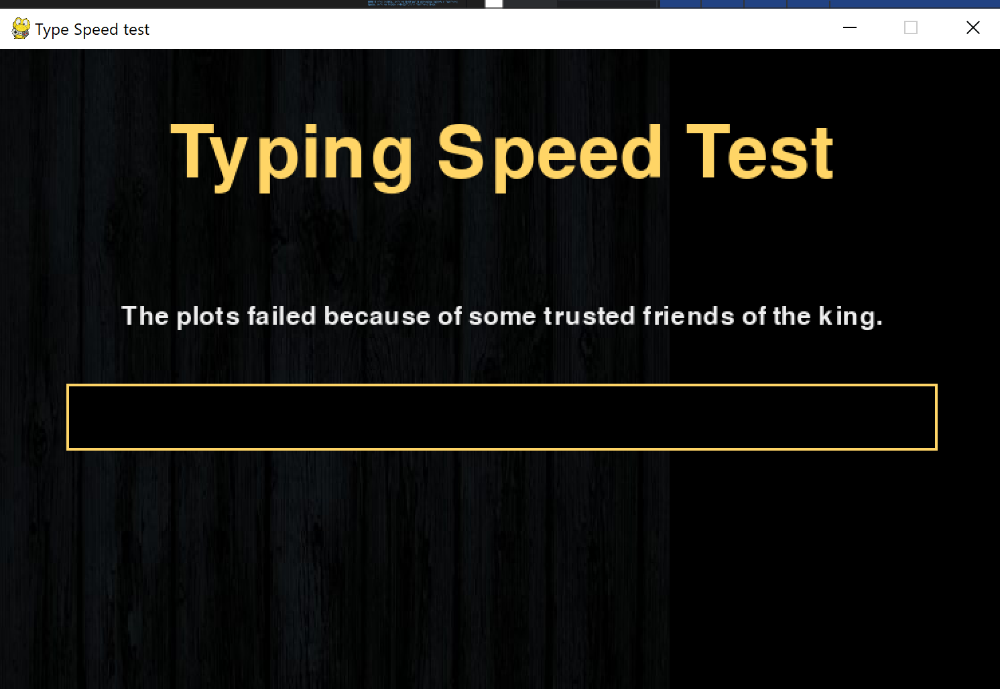
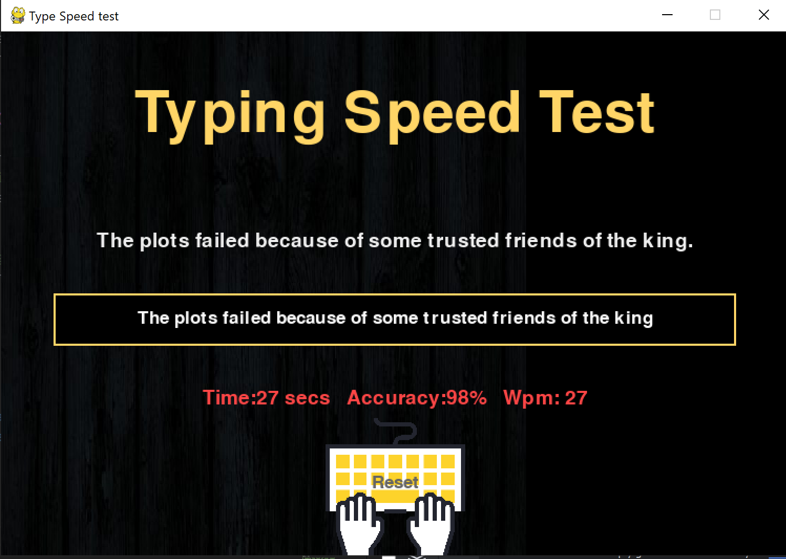

# Игра-тренажер для проверки скорости печати на клавиатуре

# Поснения к коду

## 1) Приведенный ниже код предназначен для импорта модулей

#### Код:

```python
import pygame
from pygame.locals import *
import sys
import time
import random
```

## 2) Приведенный ниже код для класса самой игры

#### Код:

```python
class Game:
   
    def __init__(self):
        self.w=750
        self.h=500
        self.reset=True
        self.active = False
        self.input_text=''
        self.word = ''
        self.time_start = 0
        self.total_time = 0
        self.accuracy = '0%'
        self.results = 'Time:0 Accuracy:0 % Wpm:0 '
        self.wpm = 0
        self.end = False
        self.HEAD_C = (255,213,102)
        self.TEXT_C = (240,240,240)
        self.RESULT_C = (255,70,70)
        
       
        pygame.init()
        self.open_img = pygame.image.load('type-speed-open.png')
        self.open_img = pygame.transform.scale(self.open_img, (self.w,self.h))


        self.bg = pygame.image.load('background.jpg')
        self.bg = pygame.transform.scale(self.bg, (500,750))

        self.screen = pygame.display.set_mode((self.w,self.h))
        pygame.display.set_caption('Type Speed test')
```
### Объяснение:

#### В этом классе мы инициализировали ширину и высоту окна и переменные, необходимые для вычисления, а затем инициализировали pygame и загрузили изображения. Переменная screen - самая важная, на которой мы будем рисовать


## Приведенный ниже код предназначен для модуля draw_text

#### код:

```python
def draw_text(self, screen, msg, y ,fsize, color):
        font = pygame.font.Font(None, fsize)
        text = font.render(msg, 1,color)
        text_rect = text.get_rect(center=(self.w/2, y))
        screen.blit(text, text_rect)
        pygame.display.update() 
```

### Объяснение:

#### Этот модуль определяет шрифт, текст, размер и цвет экрана.

## Приведенный ниже код предназначен для модуля get_sentence
#### Код:

```python
def get_sentence(self):
        f = open('sentences.txt').read()
        sentences = f.split('\n')
        sentence = random.choice(sentences)
        return sentence
```
### Объяснение

#### В этом модуле, который получает предложение данных в текстовом файле, которое должно выполняться в текстовом поле.

## Приведенный ниже код предназначен для модуля show_results

#### код:

```python
def show_results(self, screen):
        if(not self.end):
            #Calculate time
            self.total_time = time.time() - self.time_start
               
            #Calculate accuracy
            count = 0
            for i,c in enumerate(self.word):
                try:
                    if self.input_text[i] == c:
                        count += 1
                except:
                    pass
            self.accuracy = count/len(self.word)*100
           
            #Calculate words per minute
            self.wpm = len(self.input_text)*60/(5*self.total_time)
            self.end = True
            print(self.total_time)
                
            self.results = 'Time:'+str(round(self.total_time)) +" secs   Accuracy:"+ str(round(self.accuracy)) + "%" + '   Wpm: ' + str(round(self.wpm))

            # draw icon image
            self.time_img = pygame.image.load('icon.png')
            self.time_img = pygame.transform.scale(self.time_img, (150,150))
            #screen.blit(self.time_img, (80,320))
            screen.blit(self.time_img, (self.w/2-75,self.h-140))
            self.draw_text(screen,"Reset", self.h - 70, 26, (100,100,100))
            
            print(self.results)
            pygame.display.update()
```

### Объяснение

#### Этот модуль показывает результаты вашего теста набора текста, который зависит от вашей скорости набора текста.

## Приведенный ниже код предназначен для запуска модуля

#### код:

```python
def run(self):
        self.reset_game()
    
       
        self.running=True
        while(self.running):
            clock = pygame.time.Clock()
            self.screen.fill((0,0,0), (50,250,650,50))
            pygame.draw.rect(self.screen,self.HEAD_C, (50,250,650,50), 2)
            # update the text of user input
            self.draw_text(self.screen, self.input_text, 274, 26,(250,250,250))
            pygame.display.update()
            for event in pygame.event.get():
                if event.type == QUIT:
                    self.running = False
                    sys.exit()
                elif event.type == pygame.MOUSEBUTTONUP:
                    x,y = pygame.mouse.get_pos()
                    # position of input box
                    if(x>=50 and x<=650 and y>=250 and y<=300):
                        self.active = True
                        self.input_text = ''
                        self.time_start = time.time() 
                     # position of reset box
                    if(x>=310 and x<=510 and y>=390 and self.end):
                        self.reset_game()
                        x,y = pygame.mouse.get_pos()
         
                        
                elif event.type == pygame.KEYDOWN:
                    if self.active and not self.end:
                        if event.key == pygame.K_RETURN:
                            print(self.input_text)
                            self.show_results(self.screen)
                            print(self.results)
                            self.draw_text(self.screen, self.results,350, 28, self.RESULT_C)  
                            self.end = True
                            
                        elif event.key == pygame.K_BACKSPACE:
                            self.input_text = self.input_text[:-1]
                        else:
                            try:
                                self.input_text += event.unicode
                            except:
                                pass
            
            pygame.display.update()
             
                
        clock.tick(60)
```
### Объяснение

#### Этот модуль, который является основным модулем нашего класса будет обрабатывать все события.

## Приведенный ниже код предназначен для запуска модуля reset_game

#### код:

```python
 def reset_game(self):
        self.screen.blit(self.open_img, (0,0))

        pygame.display.update()
        time.sleep(1)
        
        self.reset=False
        self.end = False

        self.input_text=''
        self.word = ''
        self.time_start = 0
        self.total_time = 0
        self.wpm = 0

        # Get random sentence 
        self.word = self.get_sentence()
        if (not self.word): self.reset_game()
        #drawing heading
        self.screen.fill((0,0,0))
        self.screen.blit(self.bg,(0,0))
        msg = "Typing Speed Test"
        self.draw_text(self.screen, msg,80, 80,self.HEAD_C)  
        # draw the rectangle for input box
        pygame.draw.rect(self.screen,(255,192,25), (50,250,650,50), 2)

        # draw the sentence string
        self.draw_text(self.screen, self.word,200, 28,self.TEXT_C)
        
        pygame.display.update()
```

### Объяснение

#### Этот модуль, который сбрасывает все переменные, чтобы мы могли снова начать печатать тестирование скорости печати







# Листинг

```python
import pygame
from pygame.locals import *
import sys
import time
import random

# 750 x 500    
    
class Game:
   
    def __init__(self):
        self.w=750
        self.h=500
        self.reset=True
        self.active = False
        self.input_text=''
        self.word = ''
        self.time_start = 0
        self.total_time = 0
        self.accuracy = '0%'
        self.results = 'Time:0 Accuracy:0 % Wpm:0 '
        self.wpm = 0
        self.end = False
        self.HEAD_C = (255,213,102)
        self.TEXT_C = (240,240,240)
        self.RESULT_C = (255,70,70)
        
       
        pygame.init()
        self.open_img = pygame.image.load('type-speed-open.png')
        self.open_img = pygame.transform.scale(self.open_img, (self.w,self.h))


        self.bg = pygame.image.load('background.jpg')
        self.bg = pygame.transform.scale(self.bg, (500,750))

        self.screen = pygame.display.set_mode((self.w,self.h))
        pygame.display.set_caption('Type Speed test')
       
        
    def draw_text(self, screen, msg, y ,fsize, color):
        font = pygame.font.Font(None, fsize)
        text = font.render(msg, 1,color)
        text_rect = text.get_rect(center=(self.w/2, y))
        screen.blit(text, text_rect)
        pygame.display.update()   
        
    def get_sentence(self):
        f = open('sentences.txt').read()
        sentences = f.split('\n')
        sentence = random.choice(sentences)
        return sentence

    def show_results(self, screen):
        if(not self.end):
            #Calculate time
            self.total_time = time.time() - self.time_start
               
            #Calculate accuracy
            count = 0
            for i,c in enumerate(self.word):
                try:
                    if self.input_text[i] == c:
                        count += 1
                except:
                    pass
            self.accuracy = count/len(self.word)*100
           
            #Calculate words per minute
            self.wpm = len(self.input_text)*60/(5*self.total_time)
            self.end = True
            print(self.total_time)
                
            self.results = 'Time:'+str(round(self.total_time)) +" secs   Accuracy:"+ str(round(self.accuracy)) + "%" + '   Wpm: ' + str(round(self.wpm))

            # draw icon image
            self.time_img = pygame.image.load('icon.png')
            self.time_img = pygame.transform.scale(self.time_img, (150,150))
            #screen.blit(self.time_img, (80,320))
            screen.blit(self.time_img, (self.w/2-75,self.h-140))
            self.draw_text(screen,"Reset", self.h - 70, 26, (100,100,100))
            
            print(self.results)
            pygame.display.update()

    def run(self):
        self.reset_game()
    
       
        self.running=True
        while(self.running):
            clock = pygame.time.Clock()
            self.screen.fill((0,0,0), (50,250,650,50))
            pygame.draw.rect(self.screen,self.HEAD_C, (50,250,650,50), 2)
            # update the text of user input
            self.draw_text(self.screen, self.input_text, 274, 26,(250,250,250))
            pygame.display.update()
            for event in pygame.event.get():
                if event.type == QUIT:
                    self.running = False
                    sys.exit()
                elif event.type == pygame.MOUSEBUTTONUP:
                    x,y = pygame.mouse.get_pos()
                    # position of input box
                    if(x>=50 and x<=650 and y>=250 and y<=300):
                        self.active = True
                        self.input_text = ''
                        self.time_start = time.time() 
                     # position of reset box
                    if(x>=310 and x<=510 and y>=390 and self.end):
                        self.reset_game()
                        x,y = pygame.mouse.get_pos()
         
                        
                elif event.type == pygame.KEYDOWN:
                    if self.active and not self.end:
                        if event.key == pygame.K_RETURN:
                            print(self.input_text)
                            self.show_results(self.screen)
                            print(self.results)
                            self.draw_text(self.screen, self.results,350, 28, self.RESULT_C)  
                            self.end = True
                            
                        elif event.key == pygame.K_BACKSPACE:
                            self.input_text = self.input_text[:-1]
                        else:
                            try:
                                self.input_text += event.unicode
                            except:
                                pass
            
            pygame.display.update()
             
                
        clock.tick(60)

    def reset_game(self):
        self.screen.blit(self.open_img, (0,0))

        pygame.display.update()
        time.sleep(1)
        
        self.reset=False
        self.end = False

        self.input_text=''
        self.word = ''
        self.time_start = 0
        self.total_time = 0
        self.wpm = 0

        # Get random sentence 
        self.word = self.get_sentence()
        if (not self.word): self.reset_game()
        #drawing heading
        self.screen.fill((0,0,0))
        self.screen.blit(self.bg,(0,0))
        msg = "Typing Speed Test"
        self.draw_text(self.screen, msg,80, 80,self.HEAD_C)  
        # draw the rectangle for input box
        pygame.draw.rect(self.screen,(255,192,25), (50,250,650,50), 2)

        # draw the sentence string
        self.draw_text(self.screen, self.word,200, 28,self.TEXT_C)
        
        pygame.display.update()


Game().run()


```